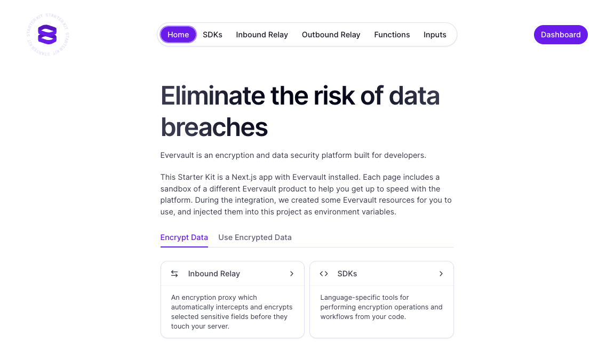

# Evervault + Next.js Starter Kit

Add industry-standard encryption to any sensitive data field in your Next.js app with this starter kit.

## Features

- Instantly use the Evervault client-side or server-side SDKs to encrypt any plaintext form or JSON field.
- Set a proxy in front of your server that will intercept data fields of your choosing and encrypt them en route.
- Pass encrypted data to any third-party API, only decrypting it once it hits the intended host.
- Process data encrypted by Evervault using secure serverless functions hosted on Evervault’s infrastructure written in Node.js or Python.

## Get started

Deploy the integration to set up your Evervault Account. This will allow you to use the starter kit, and access your [Evervault Dashboard](https://app.evervault.com/).

Try out:
- Encrypting location data coming into your app from your browser
- Sending data securely Open-Meteo’s Weather API (or, replace with an API of your choice)
- Calculating the distance between your location and New York by only decrypting the data in a secure, untouchable function
- Customize any of the data sources and functionality using your own data and APIs
- Encrypt cardholder data in real-time: The card details will never be in plaintext
